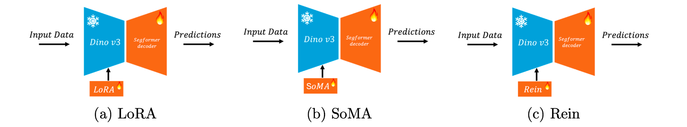

# Domain Generalization for Remote Sensing Semantic Segmentation

[](https://www.python.org/downloads/release/python-3110/)
[](https://pytorch.org/)
[](https://opensource.org/licenses/MIT)


<p align="center">
  
</p>


## Overview

Domain shift is a critical challenge in remote sensing: models trained on imagery from one geographic region or sensor often suffer substantial performance degradation when deployed in different environments. This project systematically investigates how to effectively leverage vision foundation models for cross-domain semantic segmentation.

### Research Questions

1. How does decoder capacity influence domain generalization under frozen backbones?
2. Which parameter-efficient fine-tuning strategies best preserve pretrained representations while enabling task-specific adaptation?
3. How do photometric vs. geometric augmentations differentially impact cross-domain robustness?

##  Key Features

- **Vision Foundation Model**: DINOv3 ViT-S+ backbone with multi-scale feature extraction
- **Parameter-Efficient Fine-Tuning Methods**:
  - **LoRA** (Low-Rank Adaptation)
  - **SoRA/SoMA** (SVD-initialized LoRA)
  - **LoRAReins** (Feature-space adaptation with learnable tokens)
- **Lightweight Decoder**: SegFormer-style MLP decoder
- **Augmentation Analysis**: Two-axis framework (αp × αg) for photometric and geometric augmentations
- **Multiple Benchmarks**: ISPRS (Potsdam ↔ Vaihingen) and LoveDA (Urban ↔ Rural)

## 🛠 Installation

### Prerequisites

- Python 3.11+
- CUDA 12.x
- 16GB+ GPU memory recommended

### Setup Environment

```bash
# Clone the repository
git clone https://github.com/yourusername/domain-generalization-remote-sensing.git
cd domain-generalization-remote-sensing

# Create conda environment
conda env create -f environment.yml
conda activate dinov3

# Or using pip
pip install -r requirements.txt
```

### Verify Installation

```python
import torch
import timm

# Check CUDA availability
print(f"CUDA available: {torch.cuda.is_available()}")
print(f"PyTorch version: {torch.__version__}")

# Verify DINOv3 model
model = timm.create_model('vit_small_plus_patch16_dinov3.lvd1689m', pretrained=True)
print("DINOv3 loaded successfully!")
```

##  Datasets

### ISPRS Semantic Labeling

Download from [ISPRS 2D Semantic Labeling Contest](https://www.isprs.org/education/benchmarks/UrbanSemLab/default.aspx) |

**Classes (6)**: Impervious surfaces, Buildings, Low vegetation, Trees, Cars, Clutter/background

### LoveDA

Download from [LoveDA GitHub](https://github.com/Junjue-Wang/LoveDA)

**Classes (7)**: Background, Building, Road, Water, Barren, Forest, Agricultural

### Data Structure

```
data/
├── potsdam_rgb/
│   ├── img_dir/
│   │   ├── train/
│   │   └── val/
│   └── ann_dir/
│       ├── train/
│       └── val/
├── vaihingen_irrg/
│   ├── img_dir/
│   └── ann_dir/
└── loveda/
    ├── Train/
    │   ├── Urban/
    │   │   ├── images_png/
    │   │   └── masks_png/
    │   └── Rural/
    └── Val/
        ├── Urban/
        └── Rural/
```
##  Usage

### Quick Start

```bash
# Run SoRA experiment on ISPRS (Vaihingen → Potsdam)
python experiments/isprs_sora_gridsearch.py \
    --config L3 \
    --scenario V2P \
    --seeds 42 123 456

# Run LoRAReins experiment on LoveDA (Rural → Urban)
python experiments/loveda_reins_gridsearch.py \
    --config R5 \
    --scenario R2U \
    --seeds 42 123 456
```

## Acknowledgments

- [DINOv3](https://github.com/facebookresearch/dinov3) for the vision foundation model
- [ISPRS](https://www.isprs.org/) for the ISPRS datasets
- [LoveDA](https://github.com/Junjue-Wang/LoveDA) for the LoveDA dataset

## License

This project is licensed under the MIT License - see the [LICENSE](LICENSE) file for details.

